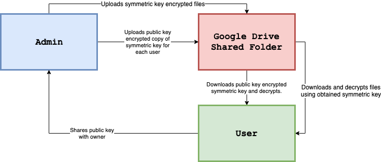

# CS3031 Secure Cloud

The aim of the project was to develop a system to securely store files on a Google Drive folder that can be shared with a group of other Google Drive users who can decrypt the owners files. To any other user, the files are encrypted.

## System Architecture

My approach uses an AES symmetric key that can be used to encrypt and decrypt files. The owner of the shared folder creates this symmetric key on creation of the shared folder and then uses this key to encrypt each file uploaded to the folder.

In order for shared users to be able to decrypt the encrypted files in the shared folder, they need a copy of the symmetric key. To safely share the symmetric key with these users, each user generates an RSA asymmetric key-pair and shares the __public key__ with the owner. The owner then encrypts the symmetric key with the provided public key. The user can then decrypt the encrypted symmetric key using their private key, obtaining the symmetric key so that they can decrypt the files on the shared folder.



To implement this approach, I created a client that could be run in one of two modes:

1. Admin
2. User

and would handle the key and file management for the system.

The __Admin__ mode would allow a the Google Drive user to create a shared folder, add users and remove users to have access to the folder and upload encrypted files to the folder.

The __User__ mode would allow a user to list all of the encrypted folders that have been shared with them, select a folder, download the encrypted files and decrypt them.

## Client

### Usage
| Admin Command                            | Description           |
|------------------------------------------|-----------------------|
| `admin <email>`                          | Logs in admin user.   |
| `adduser <email> <public key file path>` | Adds user to Drive and adds encrypted symmetric key to `./keys` subfolder. |
| `listusers`                              | Lists current usrs with access to folder. |
| `upload <file path>` | Encrypts file and uploads to shared folder. |
| `remove-user <user email>` | Removes user from Google Drive and remove their key. |
| `delete-file <file name>` | Deletes a file from the drive folder. |

| User Command                            | Description           |
|------------------------------------------|-----------------------|
| `user <email> <private key file path>`   | Logs in regular user. |
| `list-shared` | Lists all encrypted folders shared with user. |
| `select-shared <shared folder name>` | Selects a shared folder to download files from. |
| `download <file name>` | Decrypts file from Drive and stores it in file. |

### Implementation

The project was built as a CLI application in Go and packages were created for the `admin`, `user`, `symkey`, `asymkey` and `driveapi` features of the application.

#### Drive API

Google have built a very useful Drive API that creates an abstract method of interfacing with Google Drive natively in Go. The `driveapi.go` file includes helper functions for drive API operations required by the application:

```
package driveapi

import (
	"bytes"
	"errors"
	"fmt"
	"io/ioutil"
	"log"
	"net/http"

	"golang.org/x/net/context"
	"golang.org/x/oauth2"
	"golang.org/x/oauth2/google"
	"google.golang.org/api/drive/v3"
)

// Retrieve a token, saves the token, then returns the generated client.
func getClient(config *oauth2.Config, userType string, token *oauth2.Token) *http.Client {
	return config.Client(context.Background(), token)
}

// GetTokenFromWeb requests a token from the web, then returns the retrieved token.
func GetTokenFromWeb(config *oauth2.Config) *oauth2.Token {
	authURL := config.AuthCodeURL("state-token", oauth2.AccessTypeOffline)
	fmt.Printf("Go to the following link in your browser then type the "+
		"authorization code: \n%v\n", authURL)

	var authCode string
	if _, err := fmt.Scan(&authCode); err != nil {
		log.Fatalf("Unable to read authorization code %v", err)
	}

	tok, err := config.Exchange(context.TODO(), authCode)
	if err != nil {
		log.Fatalf("Unable to retrieve token from web %v", err)
	}
	return tok
}

// CreateDir is a helper that creates a shared folder in the root directory.
func CreateDir(service *drive.Service, name string, parent string) (*drive.File, error) {
	// Check if the folder already exists.
	r, err := service.Files.List().Q("name='" + name + "' and mimeType='application/vnd.google-apps.folder' and trashed=false").Do()
	if err != nil {
		return nil, err
	}

	// Returns first found result if folder already exists.
	if len(r.Files) != 0 {
		return r.Files[0], err
	}

	// Create new directory if one doesn't already exist.
	f := &drive.File{
		MimeType: "application/vnd.google-apps.folder",
		Name:     name,
		Parents:  []string{parent},
	}

	file, err := service.Files.Create(f).Do()
	if err != nil {
		log.Println("Could not create dir: ", err)
		return nil, err
	}

	fmt.Println("Created shared directory for user called: ", name)
	return file, nil
}

// UploadFile is a helper that uploads data as a file to Google Drive.
func UploadFile(service *drive.Service, name string, parentID string, data []byte) (*drive.File, error) {
	// Create new file with .enc at the end for encrypted.
	f := &drive.File{
		MimeType: "text/plain",
		Name:     name + ".enc",
		Parents:  []string{parentID},
	}

	// Convert data into an io Reader for Google Drive API.
	r := bytes.NewReader(data)
	// Upload Google Drive file.
	file, err := service.Files.Create(f).Media(r).Do()
	if err != nil {
		return nil, err
	}

	fmt.Println("Uploaded encrypted file:", name+".enc")
	return file, nil
}

// AddUser adds the appropriate permission to give an email Google Drive read permissions.
func AddUser(service *drive.Service, folder string, email string) error {
	var err error
	// Check if the folder already exists.
	f := GetFolder(service, folder)

	// Create folder if it doesn't exist.
	if f == nil {
		f, err = CreateDir(service, folder, "root")
		if err != nil {
			return err
		}
	}

	// Add user to folder.
	userPermission := &drive.Permission{
		Type:         "user",
		Role:         "reader",
		EmailAddress: email,
	}
	_, err = service.Permissions.Create(f.Id, userPermission).Do()
	if err != nil {
		return err
	}

	return nil
}

// RemoveUser removes read permission for a given email address to a Google Drive folder.
func RemoveUser(service *drive.Service, folder *drive.File, email string) error {
	// Get list of permissions.
	permissions, err := ListUsers(service, folder.Name)
	if err != nil {
		return err
	}

	// Check if there is a permission for given email.
	permissionID := ""
	for _, v := range permissions {
		if v.EmailAddress == email {
			permissionID = v.Id
		}
	}

	// If there is no matching permission, handle.
	if permissionID == "" {
		return errors.New("couldn't remove because couldn't find user")
	}

	// Remove permission.
	fmt.Println("Removing user...")
	err = service.Permissions.Delete(folder.Id, permissionID).Do()

	return err
}

// DeleteFile removes a file from Google Drive.
func DeleteFile(service *drive.Service, file *drive.File) error {
	err := service.Files.Delete(file.Id).Do()
	return err
}

// ListUsers lists all permissions set for a given folder in Google Drive.
func ListUsers(service *drive.Service, folder string) ([]*drive.Permission, error) {
	// Check if the folder already exists.
	f := GetFolder(service, folder)
	if f == nil {
		return nil, nil
	}

	l, err := service.Permissions.List(f.Id).Fields("permissions(id, emailAddress)").Do()
	service.Permissions.List(f.Id).Fields("'emailAddress' and 'displayName'")
	if err != nil {
		return nil, err
	}

	return l.Permissions, nil
}

// GetFolder finds the corresponding file for a folder with a given name.
func GetFolder(service *drive.Service, name string) *drive.File {
	r, err := service.Files.List().Q("name='" + name + "' and mimeType='application/vnd.google-apps.folder' and trashed=false").Do()
	if err != nil {
		log.Fatal("Couldn't get Google Drive shared folder ID: ", err)
		return nil
	}

	if len(r.Files) == 0 {
		return nil
	}

	return r.Files[0]
}

// GetFileFromID takes a file ID and returns all of the file metadata.
func GetFileFromID(service *drive.Service, id string) *drive.File {
	f, err := service.Files.Get(id).Do()
	if err != nil {
		return nil
	}

	return f
}

// GetKeyFile gets the corresponding key file given a shared folder and the user email.
func GetKeyFile(service *drive.Service, name string, parent string) *drive.File {
	r, err := service.Files.List().Q("name='keys' and mimeType='application/vnd.google-apps.folder' and trashed=false and '" + parent + "' in parents").Do()
	if err != nil {
		log.Fatal("Couldn't find keys folder in shared folder!", err)
		return nil
	}

	if len(r.Files) == 0 {
		log.Fatal("Couldn't find keys folder in shared folder!")
		return nil
	}

	keys := r.Files[0]

	r, err = service.Files.List().Q("name='" + name + ".enc' and mimeType='text/plain' and trashed=false and '" + keys.Id + "' in parents").Do()
	if err != nil {
		log.Fatal("Couldn't find encrypted symmetric key in keys folder :(", err)
		return nil
	}

	if len(r.Files) == 0 {
		log.Fatal("Couldn't find encrypted symmetric key in keys folder :(")
		return nil
	}

	return r.Files[0]
}

/*
FindFile searches for a file of given name in a given parent folder and either returns
the file or nil if it couldn't find one.
*/
func FindFile(service *drive.Service, name string, parent string) *drive.File {
	r, err := service.Files.List().Q("name='" + name + "' and trashed=false and '" + parent + "' in parents").Do()
	if err != nil {
		return nil
	}

	if len(r.Files) == 0 {
		return nil
	}

	return r.Files[0]
}

// DownloadFile takes the data from a file and loads it into memory as a byte slice.
func DownloadFile(service *drive.Service, file *drive.File) ([]byte, error) {
	res, err := service.Files.Get(file.Id).Download()
	if err != nil {
		return nil, err
	}

	result, err := ioutil.ReadAll(res.Body)
	if err != nil {
		return nil, err
	}

	return result, nil
}

// GetFolders returns all folders with '-shared' in the name in Google Drive root folder.
func GetFolders(service *drive.Service, name string) []*drive.File {
	r, err := service.Files.List().Q("name contains '-shared' and mimeType='application/vnd.google-apps.folder' and trashed=false").Do()
	if err != nil {
		log.Fatal("Couldn't find any shared folders: ", err)
		return nil
	}

	return r.Files
}

// GenerateConfig creates an OAuth config from the user credentials and.
func GenerateConfig(userType string) *oauth2.Config {
	// Read in client ID and secret.
	b, err := ioutil.ReadFile("credentials.json")
	if err != nil {
		log.Fatalf("Unable to read Google Drive client secret file: %v", err)
		return nil
	}

	// Setting necessary scope.
	var scope string
	if userType == "admin" {
		scope = drive.DriveScope
	} else {
		scope = drive.DriveReadonlyScope
	}

	config, err := google.ConfigFromJSON(b, scope)
	if err != nil {
		log.Fatalf("Unable to parse Google Drive client secret file to config: %v", err)
		return nil
	}

	return config
}

// NewDriveClient returns a client for interfacing with the Drive API.
func NewDriveClient(userType string, token *oauth2.Token) *drive.Service {
	config := GenerateConfig(userType)
	client := getClient(config, userType, token)
	srv, err := drive.New(client)
	if err != nil {
		log.Fatalf("Unable to retrieve Drive client: %v", err)
	}

	return srv
}
```

### Symmetric Key

The `symkey.go` file includes functions to generate a symmetric key, encrypt data using a symmetric key and decrypt data using a symmetric key.

```
package symkey

import (
	"crypto/aes"
	"crypto/cipher"
	"crypto/rand"
	"io"
)

// EncryptData encrypts data using a symmetric key.
func EncryptData(data, key []byte) ([]byte, error) {
	// Creates cipher and Galois/Counter mode object for sym key crypto block ciphers.
	gcm, err := genGCM(key)
	if err != nil {
		return nil, err
	}

	// Create a random nonce.
	nonce := make([]byte, gcm.NonceSize())
	_, err = io.ReadFull(rand.Reader, nonce)
	if err != nil {
		return nil, err
	}

	// Encrypt using Seal.
	return gcm.Seal(nonce, nonce, data, nil), nil
}

// DecryptData decrypts data using a symmetric key.
func DecryptData(encryptedData, key []byte) ([]byte, error) {
	// Creates cipher and Galois/Counter mode object for sym key crypto block ciphers.
	gcm, err := genGCM(key)
	if err != nil {
		return nil, err
	}

	if len(encryptedData) < gcm.NonceSize() {
		return nil, err
	}

	nonce, encryptedData := encryptedData[:gcm.NonceSize()], encryptedData[gcm.NonceSize():]
	data, err := gcm.Open(nil, nonce, encryptedData, nil)
	if err != nil {
		return nil, err
	}

	return data, nil
}

func genGCM(key []byte) (cipher.AEAD, error) {
	// Generate AES cipher from the key.
	c, err := aes.NewCipher(key)
	if err != nil {
		return nil, err
	}

	// Use Galois mode for sym key crypto block ciphers.
	gcm, err := cipher.NewGCM(c)
	if err != nil {
		return nil, err
	}

	return gcm, nil
}

// GenerateKey generates a random 32-byte sequence to use as a symmetric key.
func GenerateKey() ([]byte, error) {
	key := make([]byte, 32)

	_, err := rand.Read(key)
	if err != nil {
		return nil, err
	}

	return key, nil
}
```

### Asymmetric Key

The `asymkey.go` file includes functions to read in private and public keys from a file, encrypt and decrypt files from parsed public and private keys as well as from files.

```
package asymkey

import (
	"bufio"
	"crypto/rand"
	"crypto/rsa"
	"crypto/sha256"
	"crypto/x509"
	"encoding/asn1"
	"encoding/pem"
	"fmt"
	"os"
)

// GetKeysFromFile parses .pem private into public and private rsa key from key path.
func GetKeysFromFile(filename string) (*rsa.PublicKey, *rsa.PrivateKey, error) {
	// Check that key in path exists
	_, err := os.Stat(filename)
	if os.IsNotExist(err) {
		return nil, nil, err
	}

	fmt.Println("Opening file!")

	privateKeyFile, err := os.Open(filename)
	if err != nil {
		return nil, nil, err
	}

	pemfileinfo, _ := privateKeyFile.Stat()
	size := pemfileinfo.Size()
	pembytes := make([]byte, size)

	buffer := bufio.NewReader(privateKeyFile)
	_, err = buffer.Read(pembytes)

	data, _ := pem.Decode([]byte(pembytes))

	privateKeyFile.Close()

	privateKey, err := x509.ParsePKCS1PrivateKey(data.Bytes)
	if err != nil {
		return nil, nil, err
	}

	return &privateKey.PublicKey, privateKey, nil
}

// GetPublicKeyFromFile takes public key .pem file and generates parses it to an rsa public key.
func GetPublicKeyFromFile(filename string) (*rsa.PublicKey, error) {
	// Check that key in path exists
	_, err := os.Stat(filename)
	if os.IsNotExist(err) {
		return nil, err
	}

	fmt.Println("Reading public key file...")

	publicKeyFile, err := os.Open(filename)
	if err != nil {
		return nil, err
	}

	pemfileinfo, _ := publicKeyFile.Stat()
	size := pemfileinfo.Size()
	pembytes := make([]byte, size)

	buffer := bufio.NewReader(publicKeyFile)
	_, err = buffer.Read(pembytes)

	data, _ := pem.Decode([]byte(pembytes))

	publicKeyFile.Close()

	publicKey, err := x509.ParsePKCS1PublicKey(data.Bytes)
	if err != nil {
		return nil, err
	}

	return publicKey, nil
}

// EncryptFromPath encrypts data from private key .pem file path.
func EncryptFromPath(data []byte, keypath string) ([]byte, error) {
	publicKey, _, err := GetKeysFromFile(keypath)
	if err != nil {
		return nil, err
	}

	encryptedData, err := rsa.EncryptOAEP(sha256.New(), rand.Reader, publicKey, data, nil)
	if err != nil {
		return nil, err
	}

	return encryptedData, nil
}

// Encrypt encrypts data from rsa public key.
func Encrypt(data []byte, publicKey *rsa.PublicKey) ([]byte, error) {
	encryptedData, err := rsa.EncryptOAEP(sha256.New(), rand.Reader, publicKey, data, nil)
	if err != nil {
		return nil, err
	}

	return encryptedData, nil
}

// DecryptFromPath decrypts data from private key .pem file path.
func DecryptFromPath(encryptedData []byte, keypath string) ([]byte, error) {
	_, privateKey, err := GetKeysFromFile(keypath)
	if err != nil {
		return nil, err
	}

	data, err := rsa.DecryptOAEP(sha256.New(), rand.Reader, privateKey, encryptedData, nil)
	if err != nil {
		return nil, err
	}

	return data, nil
}

// Decrypt decrypts data from rsa private key.
func Decrypt(encryptedData []byte, privateKey *rsa.PrivateKey) ([]byte, error) {
	data, err := rsa.DecryptOAEP(sha256.New(), rand.Reader, privateKey, encryptedData, nil)
	if err != nil {
		return nil, err
	}

	return data, nil
}

func savePEMKey(fileName string, key *rsa.PrivateKey) {
	outFile, err := os.Create(fileName)
	checkError(err)
	defer outFile.Close()

	var privateKey = &pem.Block{
		Type:  "PRIVATE KEY",
		Bytes: x509.MarshalPKCS1PrivateKey(key),
	}

	err = pem.Encode(outFile, privateKey)
	checkError(err)
}

func savePublicPEMKey(fileName string, pubkey rsa.PublicKey) {
	asn1Bytes, err := asn1.Marshal(pubkey)
	checkError(err)

	var pemkey = &pem.Block{
		Type:  "PUBLIC KEY",
		Bytes: asn1Bytes,
	}

	pemfile, err := os.Create(fileName)
	checkError(err)
	defer pemfile.Close()

	err = pem.Encode(pemfile, pemkey)
	checkError(err)
}

func checkError(err error) {
	if err != nil {
		fmt.Println("Fatal error ", err.Error())
		os.Exit(1)
	}
}
```

### Admin

The `admin.go` file includes an __Admin struct__ datastructure that stores the admin's email address, Google Drive oauth token, a generated symmetric key and a Google Drive client. It then includes functions that complete the features that the admin can complete on the shared folder:

```
package admin

import (
	"crypto/rsa"
	"encoding/json"
	"fmt"
	"io/ioutil"
	"log"
	"os"
	"path/filepath"

	"../asymkey"
	"../driveapi"
	"../symkey"
	"golang.org/x/oauth2"
	drive "google.golang.org/api/drive/v3"
)

// Admin is a cacheable structure that stores information about an admin user.
type Admin struct {
	Username    string        `json:"username"`
	Token       *oauth2.Token `json:"token"`
	symkey      []byte        `json:"symkey"`
	driveClient *drive.Service
}

// AdminFile is the default name for the file to store cached admin information.
var AdminFile = "admin.json"

// New creates a new admin, generating a symmetric key for all encryption.
func New(username string) *Admin {
	// Generate symmetric key for file encryption.
	symkey, err := symkey.GenerateKey()
	if err != nil {
		return nil
	}

	admin := &Admin{}
	admin.Username = username
	admin.symkey = symkey

	return admin
}

// FromFile reads in a cached admin from a json file.
func FromFile() (*Admin, error) {
	f, err := os.Open(AdminFile)
	if err != nil {
		return nil, err
	}
	defer f.Close()

	admin := &Admin{}
	err = json.NewDecoder(f).Decode(admin)

	return admin, nil
}

// ToFile caches the admin in the form of a json file.
func (admin *Admin) ToFile() {
	f, err := os.OpenFile(AdminFile, os.O_RDWR|os.O_CREATE|os.O_TRUNC, 0600)
	if err != nil {
		log.Fatalf("Unable to cache admin: %v", err)
	}

	defer f.Close()
	json.NewEncoder(f).Encode(admin)
}

// Login gets a token for Google Drive and creates a new shared folder in the users root directory.
func (admin *Admin) Login() {
	// Generating a token for the user to access Google Drive if one doesn't already exist.
	if admin.Token != nil {
		fmt.Println("Admin already logged in!")
		return
	}

	fmt.Println("Getting a Google Drive token for admin...")
	config := driveapi.GenerateConfig("admin")
	token := driveapi.GetTokenFromWeb(config)
	admin.Token = token
	fmt.Println("Token received!")

	admin.driveClient = driveapi.NewDriveClient("admin", admin.Token)

	// Saving the current user.
	admin.ToFile()

	// Create shared directory if needed.
	driveapi.CreateDir(admin.driveClient, admin.Username+"-shared", "root")
}

/*
AddUser adds read-only access to the shared folder in the Google Drive and uploads
the public key encrypted symmetric key to the 'keys' folder.
*/
func (admin *Admin) AddUser(email string, publicKey *rsa.PublicKey) {
	// Encrypt symmetric key with users public key.
	fmt.Println("Encrypting Symmetric Key with ", email, " public key...")
	encryptedsymkey, err := asymkey.Encrypt(admin.symkey, publicKey)
	if err != nil {
		log.Fatal("Couldn't encrypt symmetric key with public key: ", err)
		os.Exit(1)
	}

	// Generate a new client.
	admin.driveClient = driveapi.NewDriveClient("admin", admin.Token)

	// Get shared folder.
	folder := driveapi.GetFolder(admin.driveClient, admin.Username+"-shared")
	if folder == nil {
		log.Fatal("Couldn't find shared folder!")
		os.Exit(1)
	}

	// Create Keys folder.
	keysFolder, err := driveapi.CreateDir(admin.driveClient, "keys", folder.Id)
	if err != nil {
		log.Fatal("Couldn't create keys folder: ", err)
		os.Exit(1)
	}

	// Upload encrypted symmetric key.
	_, err = driveapi.UploadFile(admin.driveClient, email, keysFolder.Id, encryptedsymkey)
	if err != nil {
		log.Fatal("Couldn't upload public key for ", email)
		os.Exit(1)
	}

	err = driveapi.AddUser(admin.driveClient, admin.Username+"-shared", email)
	if err != nil {
		log.Fatal("Couldn't add user: ", err)
		os.Exit(1)
	}

	fmt.Println("An invite has been sent to: ", email)
}

/*
RemoveUser removes read access from shared Google Drive folder and removes encrypted
symmetric key for user from keys folder.
*/
func (admin *Admin) RemoveUser(email string) {
	// Generate a new client.
	admin.driveClient = driveapi.NewDriveClient("admin", admin.Token)

	// Get shared folder.
	folder := driveapi.GetFolder(admin.driveClient, admin.Username+"-shared")
	if folder == nil {
		log.Fatal("Couldn't find shared folder!")
		os.Exit(1)
	}

	// Remove user.
	err := driveapi.RemoveUser(admin.driveClient, folder, email)
	if err != nil {
		log.Fatal("Couldn't remove user: ", err)
		os.Exit(1)
	}

	// Remove user encrypted symmetric key.
	keysFile := driveapi.GetKeyFile(admin.driveClient, email, folder.Id)

	err = driveapi.DeleteFile(admin.driveClient, keysFile)
	if err != nil {
		log.Fatal("Couldn't delete users encrypted symmetric key file: ", err)
	}

	fmt.Println("Successfully removed user: ", email)
}

// ListUsers lists all of the users that the shared folder has been shared with.
func (admin *Admin) ListUsers() {
	//Generate a new client.
	admin.driveClient = driveapi.NewDriveClient("admin", admin.Token)

	users, err := driveapi.ListUsers(admin.driveClient, admin.Username+"-shared")
	if err != nil {
		log.Fatal("Couldn't get users list: ", err)
	}

	fmt.Println("----Users----")
	for _, user := range users {
		fmt.Println(user.EmailAddress)
	}
}

// UploadFile uploads file from given path.
func (admin *Admin) UploadFile(path string) {
	// Generate a new client.
	admin.driveClient = driveapi.NewDriveClient("admin", admin.Token)

	// Get shared folder.
	folder := driveapi.GetFolder(admin.driveClient, admin.Username+"-shared")
	if folder == nil {
		log.Fatal("Couldn't find shared folder!")
		os.Exit(1)
	}

	// Read file into memory.
	fmt.Println("Reading file to upload...")
	data, err := ioutil.ReadFile(path)
	if err != nil {
		log.Fatal("Couldn't read in file to upload: ", err)
	}

	// Encrypt data.
	fmt.Println("Encrypting file...")
	encrypted, err := symkey.EncryptData(data, admin.symkey)
	if err != nil {
		log.Fatal("Error encrypting the file: ", err)
	}

	// Extract the file name from the path.
	filename := filepath.Base(path)

	// Upload the file with the name and .enc extension to Drive.
	fmt.Println("Uploading ", filename, "...")
	_, err = driveapi.UploadFile(admin.driveClient, filename, folder.Id, encrypted)
	if err != nil {
		log.Fatal("Couldn't upload encrypted file: ", err)
	}

	fmt.Println("File Uploaded!")
}

// DeleteFile deletes a file from Google Drive shared folder.
func (admin *Admin) DeleteFile(filename string) {
	// Generate a new client.
	admin.driveClient = driveapi.NewDriveClient("admin", admin.Token)

	fmt.Println("Deleting file...")

	// Get shared folder.
	sharedFolder := driveapi.GetFolder(admin.driveClient, admin.Username+"-shared")

	file := driveapi.FindFile(admin.driveClient, filename, sharedFolder.Id)

	err := driveapi.DeleteFile(admin.driveClient, file)
	if err != nil {
		log.Fatal("Couldn't delete file: ", err)
	}

	fmt.Println("Successfully deleted file: ", filename)
}
```

### User

The `user.go` file, similarly to the `admin.go` file contains a __User Struct__ datastructure that contains the users email address, Google Drive oauth token, symmetric key for the currently selected folder, the currently selected folder, the private key file path and the current Google drive client. It then includes a number of functions that implement its features on the shared Google Drive folder:

```
package user

import (
	"encoding/json"
	"fmt"
	"io/ioutil"
	"log"
	"os"

	"../asymkey"
	"../driveapi"
	"../symkey"
	"golang.org/x/oauth2"
	drive "google.golang.org/api/drive/v3"
)

// User is a cacheable structure that stores information about a user.
type User struct {
	Username       string        `json:"username"`
	Token          *oauth2.Token `json:"token"`
	symkey         []byte        `json:"symkey"`
	SharedFolder   string        `json:"sharedFolder"`
	PrivateKeyPath string        `json:"privateKeyPath"`
	driveClient    *drive.Service
}

// UserFile is the default name for the file to store cached user information.
var UserFile = "user.json"

// New creates a new user, and stores the path to access the private asymmetric key.
func New(email string, privateKeyPath string) *User {
	user := &User{
		Username:       email,
		PrivateKeyPath: privateKeyPath,
	}

	return user
}

// Login gets a token for Google Drive and caches the user to json file.
func (user *User) Login() {
	// Remove user that may be logged in.
	os.Remove("./user.json")

	// Generate token for Google Drive if one doesn't already exist.
	if user.Token != nil {
		fmt.Println("Admin already logged in!")
		return
	}

	fmt.Println("Logging into Google Drive...")
	config := driveapi.GenerateConfig("user")
	token := driveapi.GetTokenFromWeb(config)
	user.Token = token

	// Save the current user.
	user.ToFile()

	fmt.Println("Logged in successfully!")
}

// GetSharedFolders returns a list of the folders with a '-shared' postfix.
func (user *User) GetSharedFolders() {
	// New Client.
	user.driveClient = driveapi.NewDriveClient("user", user.Token)

	// Get matching folders.
	sharedFolders := driveapi.GetFolders(user.driveClient, "-shared")
	if sharedFolders == nil {
		fmt.Println("No shared folders found!")
		return
	}

	fmt.Println("-----Shared Folders-----")
	for _, folder := range sharedFolders {
		fmt.Println(folder.Name)
	}
}

// SelectShared selects a folder you wish the user to download files from.
func (user *User) SelectShared(name string) {
	// New client.
	user.driveClient = driveapi.NewDriveClient("user", user.Token)

	// Get the folder ID.
	f := driveapi.GetFolder(user.driveClient, name)
	if f == nil {
		fmt.Println("Are you sure the folder is shared with you?")
	}

	user.SharedFolder = f.Id
	fmt.Println("Selected folder:", name, "with id", user.SharedFolder)

	// Get the symmetric key for the folder.
	encFile := driveapi.GetKeyFile(user.driveClient, user.Username, user.SharedFolder)
	fmt.Println("Encrypted File ID: ", encFile.Id)

	// Download the encrypted symmetric key.
	fmt.Println("Downloading encrypted symmetric key...")
	encKey, err := driveapi.DownloadFile(user.driveClient, encFile)
	if err != nil {
		fmt.Println("Couldn't download encrypted symmetric key file :(", err)
	}

	// Decrypt the encrypted key.
	decrKey, err := asymkey.DecryptFromPath(encKey, user.PrivateKeyPath)
	if err != nil {
		fmt.Println("Couldn't decrypt the key: ", err)
	}

	fmt.Println("Successfully decrypted the key: ", string(decrKey))
	user.symkey = decrKey

	// Save the user to a file.
	user.ToFile()
}

// Download finds and downloads a file from the currently selected folder.
func (user *User) Download(filename string) {
	// New client.
	user.driveClient = driveapi.NewDriveClient("user", user.Token)

	// Get current folder.
	if user.SharedFolder == "" {
		fmt.Println("Please select a shared folder first by: client select-shared")
	}

	// Get file.
	file := driveapi.FindFile(user.driveClient, filename+".enc", user.SharedFolder)
	if file == nil {
		log.Fatal("Couldn't find the file you wanted to download in: ", user.SharedFolder)
		return
	}

	encrData, err := driveapi.DownloadFile(user.driveClient, file)
	if err != nil {
		log.Fatal("Couldn't download the file: ", err)
		return
	}

	// Decrypt the data.
	decrData, err := symkey.DecryptData(encrData, user.symkey)
	if err != nil {
		log.Fatal("Couldn't decrypt the file: ", err)
		return
	}

	// Put decrypted data into a file and put it into downloads folder.
	os.MkdirAll("./downloads", os.ModePerm)
	err = ioutil.WriteFile("./downloads/"+filename, decrData, 0644)
	if err != nil {
		log.Fatal("Couldn't write decrypted data to file: ", err)
		return
	}

	fmt.Println("File downloaded to: ./downloads/" + filename)
}

// ToFile caches the user in the form of a json file.
func (user *User) ToFile() {
	f, err := os.OpenFile(UserFile, os.O_RDWR|os.O_CREATE|os.O_TRUNC, 0600)
	if err != nil {
		log.Fatalf("Unable to cache user: %v", err)
	}

	defer f.Close()
	json.NewEncoder(f).Encode(user)
}

// FromFile reads in a cached user from a json file.
func FromFile() (*User, error) {
	f, err := os.Open(UserFile)
	if err != nil {
		return nil, err
	}
	defer f.Close()

	user := &User{}
	err = json.NewDecoder(f).Decode(user)

	return user, nil
}
```

### Main file

The `client.go` file contains the mainline for the application. It parses the arguments being passed into the program and runs the corresponding admin or user functions as needed:

```
package main

import (
	"fmt"
	"log"
	"os"

	"./admin"
	"./asymkey"
	"./user"
)

func main() {
	if len(os.Args) == 2 {
		switch os.Args[1] {
		case "listusers":
			f, err := admin.FromFile()
			if err != nil {
				log.Fatal("Not logged in as admin: ", err)
			}

			f.ListUsers()

		case "list-shared":
			f, err := user.FromFile()
			if err != nil {
				log.Fatal("Not logged in as user: ", err)
			}

			f.GetSharedFolders()

		case "--help":
			fmt.Println("------Usage------")
			fmt.Println("client admin <email>")
			fmt.Println("client adduser <email> <RSA public key file path>")
			fmt.Println("client listusers")
			fmt.Println("client list-shared")
			fmt.Println("client upload <file path>")
			fmt.Println("client select-shared <shared folder name>")
			fmt.Println("client download <file name>")
			fmt.Println("client delete-file <file name>")
			fmt.Println("client user <email> <RSA private key file path>")
			fmt.Println("client remove-user <user email>")
		}

	} else if len(os.Args) == 3 {
		switch os.Args[1] {
		case "admin":
			f, _ := admin.FromFile()
			if f != nil && f.Username == os.Args[2] {
				fmt.Println("Already logged in as:", f.Username)
				return
			}

			fmt.Println("Logging in...")
			currUser := admin.New(os.Args[2])
			currUser.Login()

			fmt.Println("Successfully logged in!")
		case "upload":
			// Read in current admin user.
			f, err := admin.FromFile()
			if err != nil {
				log.Fatal("Not logged in as admin: ", err)
				os.Exit(1)
			}

			// Upload file.
			f.UploadFile(os.Args[2])

		case "select-shared":
			f, err := user.FromFile()
			if err != nil {
				log.Fatal("Not logged in as user: ", err)
			}

			f.SelectShared(os.Args[2])

		case "download":
			f, err := user.FromFile()
			if err != nil {
				log.Fatal("Not logged in as user: ", err)
			}

			f.Download(os.Args[2])

		case "remove-user":
			f, err := admin.FromFile()
			if err != nil {
				log.Fatal("Not logged in as admin: ", err)
				os.Exit(1)
			}

			f.RemoveUser(os.Args[2])

		case "delete-file":
			f, err := admin.FromFile()
			if err != nil {
				log.Fatal("Not logged in as admin: ", err)
				os.Exit(1)
			}

			f.DeleteFile(os.Args[2] + ".enc")
		}
	} else if len(os.Args) == 4 {
		switch os.Args[1] {
		case "adduser":
			// Read in current admin user.
			f, err := admin.FromFile()
			if err != nil {
				log.Fatal("Not logged in as admin: ", err)
				os.Exit(1)
			}

			// Get new users public key.
			publicKey, err := asymkey.GetPublicKeyFromFile(os.Args[3])
			if err != nil {
				log.Fatal("Problem getting users public key: ", err)
				os.Exit(1)
			}

			// Add user to Google Drive with read-only permissions.
			f.AddUser(os.Args[2], publicKey)
		case "user":
			// Check if user already logged in.
			f, _ := user.FromFile()
			if f != nil && f.Username == os.Args[2] {
				fmt.Println("Already logged in as:", f.Username)
			}

			// Create new user.
			fmt.Println("Logging in...")
			currUser := user.New(os.Args[2], os.Args[3])
			currUser.Login()

			fmt.Println("Successfully logged in!")
		}
	}
}
```

### Installation

Navigate to the `./client` folder and run:
```
$ go build client.go
```

You can then run the client program.

## Keygen

### Usage

To use the keygen program to generate a new asymmetric key-pair, run:

```
$ ./keygen <keyname>
```

### Implementation

The `keygen.go` file simply generates an RSA asymmetric key-pair and stores them in the same directory as `.pem` files:

```
package main

import (
	"crypto/rand"
	"crypto/rsa"
	"crypto/x509"
	"encoding/asn1"
	"encoding/pem"
	"fmt"
	"os"
)

func main() {
	if len(os.Args) == 2 {
		GeneratePair(os.Args[1])
	} else {
		fmt.Println("Usage: keygen <keyname>")
	}
}

func GeneratePair(keyName string) {
	if checkRSA(keyName) {
		fmt.Println("Generating a public/private key pair...")
		generateAsymmetricPair(keyName)
		fmt.Println("Generated RSA key pair!")
	} else {
		fmt.Println("RSA key pair already generated!")
	}
}

func generateAsymmetricPair(keyName string) {
	os.Mkdir("keys", os.ModePerm)

	reader := rand.Reader
	bitSize := 2048

	// Generate asymmetric key.
	key, err := rsa.GenerateKey(reader, bitSize)
	checkError(err)

	// Saves keys as .pem files.
	savePEMKey(keyName+".pem", key)
	savePublicPEMKey(keyName+"-public.pem", key.PublicKey)
}

func checkRSA(keyName string) bool {
	_, err := os.Stat(keyName)
	return os.IsNotExist(err)
}

func savePEMKey(fileName string, key *rsa.PrivateKey) {
	outFile, err := os.Create(fileName)
	checkError(err)
	defer outFile.Close()

	var privateKey = &pem.Block{
		Type:  "PRIVATE KEY",
		Bytes: x509.MarshalPKCS1PrivateKey(key),
	}

	err = pem.Encode(outFile, privateKey)
	checkError(err)
}

func savePublicPEMKey(fileName string, pubkey rsa.PublicKey) {
	asn1Bytes, err := asn1.Marshal(pubkey)
	checkError(err)

	var pemkey = &pem.Block{
		Type:  "PUBLIC KEY",
		Bytes: asn1Bytes,
	}

	pemfile, err := os.Create(fileName)
	checkError(err)
	defer pemfile.Close()

	err = pem.Encode(pemfile, pemkey)
	checkError(err)
}

func checkError(err error) {
	if err != nil {
		fmt.Println("Fatal error ", err.Error())
		os.Exit(1)
	}
}
```

### Installation

As with the client, run:
```
$ go build keygen.go
```